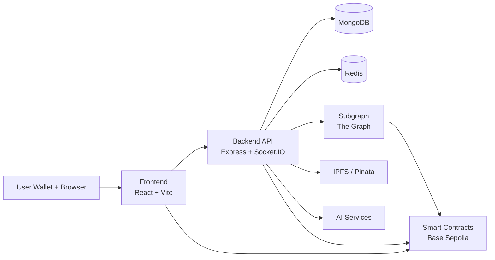
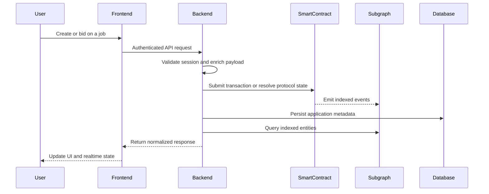

# NeuroGuild Network

Decentralized talent marketplace and governance network powered by on-chain reputation, job escrow, and indexed protocol data.

## Overview

NeuroGuild Network is a Web3 hiring and coordination system for matching clients and freelancers around verifiable activity instead of self-reported resumes. The platform combines smart-contract-enforced job execution, soulbound reputation primitives, DAO governance, and off-chain application services into a single operating stack.

The core idea is straightforward: critical trust signals such as identity registration, job lifecycle events, dispute outcomes, governance activity, and reputation updates should be recorded or derived from protocol state, while the application layer provides the UX, search, messaging, AI assistance, and operational APIs required for day-to-day product usage.

## Key Features

- Wallet-based authentication using Sign-In With Ethereum semantics and JWT-backed application sessions
- Role-aware product flows for clients, freelancers, and governance participants
- On-chain job creation, bidding, escrow, work submission, completion, and dispute handling
- Soulbound reputation and skill credentialing through `ReputationSBT` and `SkillSBT`
- Governance stack with token voting, timelock execution, treasury, and council registry
- Indexed protocol state through a The Graph subgraph for jobs, proposals, votes, token activity, and timelock operations
- Real-time messaging and notification delivery over Socket.IO
- IPFS-backed metadata storage for jobs, proposals, and token metadata
- AI-assisted job enrichment and scoring services integrated in the backend

## System Architecture

NeuroGuild is organized as a multi-service monorepo. The frontend handles wallet connectivity, application state, and user workflows. The backend exposes authenticated HTTP and WebSocket APIs, coordinates with MongoDB and Redis, resolves indexed protocol state through the subgraph, and bridges to external services such as IPFS and AI providers. Smart contracts on Base Sepolia define the source of truth for protocol actions. The Graph indexes emitted events into queryable entities for the application layer.



## Architecture Components

### Frontend

The frontend in [`Frontend/`](/home/suraj/Documents/NeuroGuild-Network/Frontend) is a Vite-based React application responsible for wallet onboarding, authenticated user flows, dashboard views, governance screens, job management, and reputation-related UX. It integrates Wagmi, Viem, Ethers, and RainbowKit for wallet connectivity and contract interaction, while using REST and Socket.IO to consume backend capabilities.

### Backend

The backend in [`Backend/`](/home/suraj/Documents/NeuroGuild-Network/Backend) is an Express service with Socket.IO support. It manages authentication, profile orchestration, job APIs, messaging, notifications, governance queries, AI-powered enrichment, and contract-adjacent workflows such as metadata generation, subgraph queries, and IPFS uploads. MongoDB stores application data and Redis supports runtime infrastructure needs.

### Smart Contracts

The contracts in [`Contracts/`](/home/suraj/Documents/NeuroGuild-Network/Contracts) define the protocol layer:

- `UserRegistry` for user registration and protocol identity
- `JobContract` for job creation, bids, escrowed execution, rating, and disputes
- `ReputationSBT` for non-transferable reputation state
- `SkillSBT` for skill credential issuance
- `GovernanceToken`, `GoverContract`, and `TimeLock` for governance
- `CouncilRegistry` for council membership and governance-linked access
- `Treasury` and `Box` for managed protocol assets and proposal execution targets

### Indexer / Subgraph

The subgraph in [`subgraph/neuroguild-network/`](/home/suraj/Documents/NeuroGuild-Network/subgraph/neuroguild-network) indexes contract events into queryable entities. It tracks jobs, bids, disputes, governance proposals, vote history, token delegation, timelock operations, treasury-related configuration, and credential activity. This layer enables low-latency read models without moving protocol state off-chain.

### Database

MongoDB persists off-chain application records such as user profiles, conversations, messages, quiz state, notifications, and job-adjacent application metadata. Redis is available as a low-latency runtime dependency for backend coordination.

### External Services

External dependencies currently include:

- Base Sepolia RPC for contract reads and transactions
- Pinata / IPFS for metadata and asset persistence
- The Graph for indexed blockchain queries
- Google GenAI for job enhancement and scoring workflows
- GitHub OAuth for linked profile enrichment

## Request Flow

The example below shows the typical job lifecycle path through the system.



## Technology Stack

| Layer | Technology |
| --- | --- |
| Frontend | React 18, Vite, React Router, Tailwind CSS, RainbowKit, Wagmi, Viem, Ethers |
| Backend | Node.js, Express, Socket.IO, JWT, SIWE, Axios |
| Smart Contracts | Solidity `0.8.28`, Foundry |
| Governance | OpenZeppelin-style Governor + Timelock pattern |
| Indexing | The Graph, Graph Node, AssemblyScript mappings |
| Database | MongoDB, Redis |
| Storage | IPFS, Pinata |
| AI Services | Google GenAI |
| Network | Base Sepolia |
| Local Infrastructure | Docker Compose |

## Project Structure

```text
.
├── Backend/
├── Contracts/
├── Frontend/
├── subgraph/
│   └── neuroguild-network/
└── docker-compose.yml
```

- [`Backend/`](/home/suraj/Documents/NeuroGuild-Network/Backend) contains the Express API, controllers, models, middleware, Socket.IO handlers, ABI bindings, and integration services.
- [`Contracts/`](/home/suraj/Documents/NeuroGuild-Network/Contracts) contains Foundry configuration, Solidity source, deployment scripts, and broadcast artifacts.
- [`Frontend/`](/home/suraj/Documents/NeuroGuild-Network/Frontend) contains the React client, route pages, UI components, contexts, contract helpers, and wallet integration code.
- [`subgraph/neuroguild-network/`](/home/suraj/Documents/NeuroGuild-Network/subgraph/neuroguild-network) contains the Graph schema, mappings, ABI definitions, and deployment configuration.
- [`docker-compose.yml`](/home/suraj/Documents/NeuroGuild-Network/docker-compose.yml) provisions MongoDB, Redis, and the backend service for local development.
- [`subgraph/neuroguild-network/docker-compose.yml`](/home/suraj/Documents/NeuroGuild-Network/subgraph/neuroguild-network/docker-compose.yml) provisions local IPFS, Postgres, and Graph Node infrastructure.

## Local Development Setup

### Prerequisites

- Node.js 18+
- npm
- Foundry
- Docker and Docker Compose
- Access to a Base Sepolia RPC endpoint

### 1. Clone the repository

```bash
git clone <repo-url>
cd NeuroGuild-Network
```

### 2. Install application dependencies

```bash
cd Backend && npm install
cd ../Frontend && npm install
cd ../Contracts && npm install
cd ../subgraph/neuroguild-network && npm install
```

### 3. Configure environment files

Create the required `.env` and `contract.env` files for each service before starting the stack. The main variables are documented below.

### 4. Start local infrastructure

Backend infrastructure:

```bash
docker compose up -d
```

Optional local subgraph infrastructure:

```bash
cd subgraph/neuroguild-network
docker compose up -d
```

### 5. Run the services

Backend:

```bash
cd Backend
npm run dev
```

Frontend:

```bash
cd Frontend
npm run dev
```

Contracts:

```bash
cd Contracts
forge build
forge test
```

Subgraph:

```bash
cd subgraph/neuroguild-network
npm run codegen
npm run build
```

## Environment Variables

The repository uses per-service environment files. At minimum, the following variables should be supplied.

### Backend

```env
MONGODB_URI=
RPC_URL=
PRIVATE_KEY=
AI_API_KEY=
SUBGRAPH_API_KEY=
SUBGRAPH_ID=
JWT_SECRET=
JWT_EXPIRES_IN=
DOMAIN=
FRONTEND_URL=
GITHUB_CLIENT_ID=
GITHUB_CLIENT_SECRET=
PINATA_JWT=
REDIS_HOST=
REDIS_PORT=
```

### Frontend

```env
VITE_API_URL=
VITE_CLIENT_ID=
VITE_RPC_URL=
```

### Contracts

```env
PRIVATE_KEY=
RPC_URL=
REVIEW_PERIOD_DAYS=
REP_REWARD=
REP_PENALTY=
MIN_DELAY_SECONDS=
```

### Generated contract addresses

Contract deployments are propagated through `contract.env` files for the frontend, backend, and subgraph. These files include keys such as:

```env
USER_CONTRACT_ADDRESS=
JOB_CONTRACT_ADDRESS=
REPUTATIONSBT_ADDRESS=
SKILLSBT_ADDRESS=
GOVERNANCETOKEN_ADDRESS=
GOVERCONTRACT_ADDRESS=
TIMELOCK_ADDRESS=
COUNCILREGISTRY_ADDRESS=
TREASURY_ADDRESS=
BOX_ADDRESS=
USDC_ADDRESS=
```

## Smart Contract Deployment

Contracts are built and deployed with Foundry from [`Contracts/`](/home/suraj/Documents/NeuroGuild-Network/Contracts).

Compile the contracts:

```bash
cd Contracts
forge build
```

Run the deployment script against the configured RPC endpoint:

```bash
npm run deploy
```

This executes `DeploymentScript.sol`, deploys the protocol contracts, and runs [`Contracts/script/postDeploy.js`](/home/suraj/Documents/NeuroGuild-Network/Contracts/script/postDeploy.js) to write the resulting addresses into:

- [`Frontend/contract.env`](/home/suraj/Documents/NeuroGuild-Network/Frontend/contract.env)
- [`Backend/contract.env`](/home/suraj/Documents/NeuroGuild-Network/Backend/contract.env)
- [`subgraph/contract.env`](/home/suraj/Documents/NeuroGuild-Network/subgraph/contract.env)

## API Overview

The backend exposes REST endpoints under `http://localhost:5000/api`.

### Authentication

```http
GET    /api/auth/get-nonce
POST   /api/auth/verify-siwe
GET    /api/auth/check-jwt
POST   /api/auth/create-user
POST   /api/auth/logout
GET    /api/auth/public-profile/:userId
GET    /api/auth/github
GET    /api/auth/github-auth-callback
GET    /api/auth/github-auth-user
```

### Client and Freelancer

```http
GET    /api/client/get-client
PUT    /api/client/update-profile
GET    /api/freelancer/get-freelancer
PUT    /api/freelancer/update-profile
GET    /api/freelancer/fetch-questions
POST   /api/freelancer/submit-quiz
GET    /api/freelancer/skill-mint-status
POST   /api/freelancer/mint-skill-sbt
POST   /api/freelancer/is-already-mint
POST   /api/freelancer/fetch-sbt
```

### Jobs

```http
POST   /api/jobs/ai-enhancement
GET    /api/jobs/fetch-jobs
GET    /api/jobs/homepage-snapshot
GET    /api/jobs/fetch-job/:jobId
POST   /api/jobs/fetch-ai-score-and-job-interaction
POST   /api/jobs/get-job-ipfs
PUT    /api/jobs/save-job
PUT    /api/jobs/submit-bid
GET    /api/jobs/get-job-bids/:jobId
POST   /api/jobs/get-bid-proposal-ipfs
GET    /api/jobs/completed-jobs/:wallet
GET    /api/jobs/fetch-freelancer-jobs
GET    /api/jobs/fetch-client-jobs
```

### Governance, Messaging, and Notifications

```http
GET    /api/governance/fetch-proposals
GET    /api/governance/proposal/:id
POST   /api/conversations/create
GET    /api/conversations/get-conversations
GET    /api/conversations/:conversationId/messages
PATCH  /api/conversations/:conversationId/seen
POST   /api/conversations/send-message
GET    /api/notifications
POST   /api/notifications
POST   /api/notifications/job-event
PATCH  /api/notifications/mark-all-read
PATCH  /api/notifications/:notificationId/read
```

Most non-public routes require the JWT cookie issued after SIWE verification.

## Subgraph Workflow

The project includes both hosted and local Graph flows.

Generate types and build:

```bash
cd subgraph/neuroguild-network
npm run codegen
npm run build
```

Deploy locally:

```bash
npm run create-local
npm run deploy-local
```

Deploy to Graph Studio:

```bash
npm run deploy
```

## Security Notes

- This repository handles blockchain transactions and private-key-backed operations; never commit populated `.env` files.
- Contract addresses are generated automatically after deployment and consumed by multiple services; review them before running against shared environments.
- The current codebase should be treated as an actively evolving protocol stack rather than a fully hardened production deployment.

## License

No top-level license file is currently defined in this repository. Add an explicit license before public distribution.
