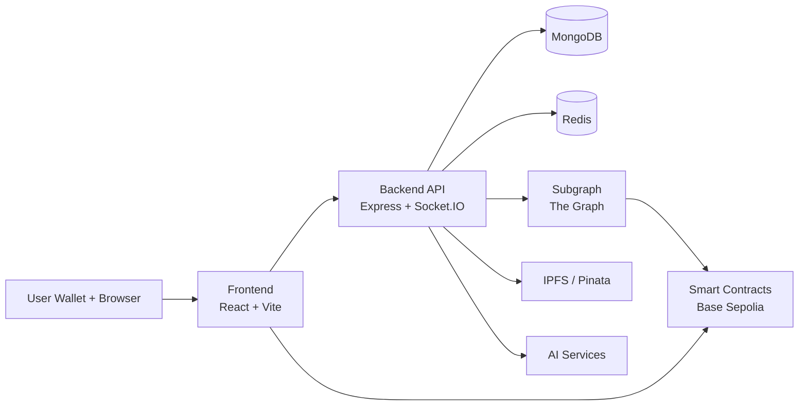

# NeuroGuild Network

Decentralized talent marketplace and governance network built around on-chain jobs, reputation credentials, and DAO coordination.

## What This Project Is

NeuroGuild combines four layers in one monorepo:

- **Frontend** for wallet onboarding, job workflows, messaging, and governance UX
- **Backend** for authenticated APIs, realtime events, profile orchestration, and integrations
- **Contracts** for protocol truth (jobs, escrow logic, SBT reputation, governance)
- **Subgraph** for indexed read models over on-chain events

The goal is to make freelancer/client trust and governance activity verifiable from protocol state while preserving a fast product UX.

## Monorepo Layout

```text
.
├── Backend/                   # Express + Socket.IO API
├── Contracts/                 # Foundry smart contracts + deploy scripts
├── Frontend/                  # React + Vite app
├── subgraph/
│   └── neuroguild-network/    # The Graph package
└── README.md
```

Package docs:

- [Backend/README.md](Backend/README.md)
- [Frontend/README.md](Frontend/README.md)
- [Contracts/README.md](Contracts/README.md)
- [subgraph/neuroguild-network/README.md](subgraph/neuroguild-network/README.md)

## Architecture



## Core Features

- Wallet-based auth with SIWE-style flow and JWT-backed app sessions
- Job lifecycle with escrow interactions and dispute-aware protocol state
- Reputation and skill credentials through `ReputationSBT` and `SkillSBT`
- Governance proposals, voting, queueing, and execution paths
- Realtime conversations and notification delivery via Socket.IO
- Indexed reads through The Graph for scalable proposal/job/history queries

## Tech Stack

| Layer | Stack |
| --- | --- |
| Frontend | React 18, Vite, Tailwind CSS, RainbowKit, Wagmi, Viem, Ethers |
| Backend | Node.js, Express, Socket.IO, Mongoose, JWT, SIWE |
| Contracts | Solidity `0.8.28`, Foundry |
| Indexing | The Graph (Graph Node / Studio), AssemblyScript mappings |
| Infra | Redis, MongoDB, Docker Compose |
| Storage/Integrations | Pinata/IPFS, Google GenAI, GitHub OAuth |

## Prerequisites

- Node.js **18+**
- npm
- Docker + Docker Compose
- Foundry (`forge`, `cast`, `anvil`) for contract development/deploy
- A Base Sepolia RPC endpoint

## Quick Start (Recommended)

### 1) Clone and install dependencies

```bash
git clone <repo-url>
cd NeuroGuild-Network

cd Backend && npm install
cd ../Frontend && npm install
cd ../Contracts && npm install
cd ../subgraph/neuroguild-network && npm install
```

### 2) Configure environment files

Create these files before running services:

- `Backend/.env`
- `Backend/contract.env`
- `Frontend/.env`
- `Frontend/contract.env`
- `Contracts/.env`
- `subgraph/contract.env`

Minimum variables (representative):

#### Backend (`Backend/.env`)

```env
MONGODB_URI=
RPC_URL=
PRIVATE_KEY=
AI_API_KEY=
SUBGRAPH_API_KEY=
SUBGRAPH_ID=
JWT_SECRET=
JWT_EXPIRES_IN=
FRONTEND_URL=
FRONTEND_REDIRECT_URL=
GITHUB_CLIENT_ID=
GITHUB_CLIENT_SECRET=
PINATA_JWT=
REDIS_HOST=
REDIS_PORT=
```

#### Frontend (`Frontend/.env`)

```env
VITE_API_URL=
VITE_SOCKET_URL=
VITE_CLIENT_ID=
VITE_RPC_URL=
```

#### Contracts (`Contracts/.env`)

```env
PRIVATE_KEY=
RPC_URL=
REVIEW_PERIOD_DAYS=
REP_REWARD=
REP_PENALTY=
MIN_DELAY_SECONDS=
```

### 3) Deploy contracts (writes shared addresses)

```bash
cd Contracts
forge build
npm run deploy
```

After deployment, address sync is written via `script/postDeploy.js` into:

- `Frontend/contract.env`
- `Backend/contract.env`
- `subgraph/contract.env`

### 4) Start backend dependencies

```bash
cd Backend
docker compose up -d redis
```

> Note: `Backend/docker-compose.yml` currently provisions `backend` + `redis`, but backend app development is typically run with `npm run dev` for hot reload.

### 5) Run backend and frontend

Backend:

```bash
cd Backend
npm run dev
```

Frontend:

```bash
cd Frontend
npm run dev
```

Default local endpoints:

- Frontend: `http://localhost:5173`
- Backend API: `http://localhost:5000`

## Subgraph (Optional Local Indexer)

If you want local Graph Node indexing:

```bash
cd subgraph/neuroguild-network
docker compose up -d
npm run codegen
npm run build
npm run create-local
npm run deploy-local
```

Graph Node endpoints are exposed on ports `8000`, `8001`, `8020`, `8030`, `8040`.

## Common Commands

### Backend

```bash
cd Backend
npm run dev
npm start
```

### Frontend

```bash
cd Frontend
npm run dev
npm run build
npm run preview
npm run lint
```

### Contracts

```bash
cd Contracts
forge build
forge test
npm run deploy
npm run postDeploy
```

### Subgraph

```bash
cd subgraph/neuroguild-network
npm run codegen
npm run build
npm run deploy
```

## API Surface (Backend)

Base URL: `http://localhost:5000/api`

- **Auth:** `/auth/get-nonce`, `/auth/verify-siwe`, `/auth/check-jwt`, `/auth/create-user`
- **Client/Freelancer:** `/client/*`, `/freelancer/*`
- **Jobs:** `/jobs/*`
- **Governance:** `/governance/fetch-proposals`, `/governance/proposal/:id`
- **Conversations:** `/conversations/*`
- **Notifications:** `/notifications/*`

Most routes require the authenticated JWT cookie set after SIWE verification.

## Troubleshooting

- **CORS error at backend startup:** ensure `FRONTEND_URL` (and optional `FRONTEND_REDIRECT_URL`) is set correctly in `Backend/.env`.
- **Wallet/contract calls failing:** verify contract addresses were synced to all `contract.env` files after deployment.
- **Subgraph returns stale/empty data:** confirm `networks.json` and deployed contract addresses/start blocks are aligned.
- **Redis connection issues:** verify `REDIS_HOST`/`REDIS_PORT` match your runtime (local or containerized).

## Security Notes

- Never commit populated `.env` or `contract.env` with real secrets/private keys.
- Treat deployment private keys and broadcast artifacts as sensitive.
- Review contract addresses before running against shared or production-like environments.

## Current Status

This repository is an actively evolving protocol/application stack. Treat defaults as development-oriented unless explicitly hardened for production.
